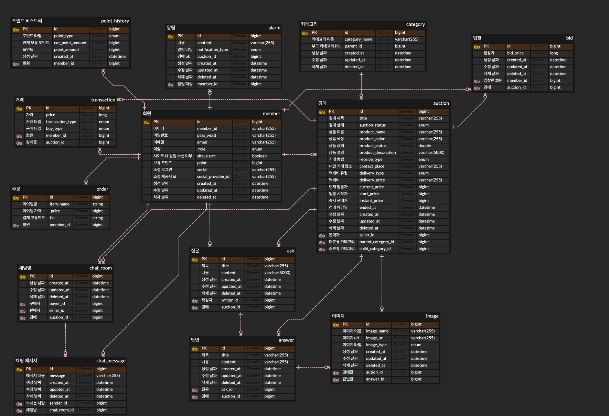

# 🛍️ 중고 물품 경매 프로젝트 - 땅땅땅!

## 😎 조원 소개

<table>
  <tr>
    <th colspan="2" align="center">프로필</th>
    <th align="center">역할</th>
    <th align="center">작업 영역</th>
  </tr>
    <tr>
    <td align="center"></td>
    <td>배진환(<a href="https://github.com/JinhwanB" target="_blank">@JinhwanB</a>) Back-End</td>
    <td align="center">팀장</td>
    <td>경매 생성 및 종료, 경매 조회 및 hot5 경매 조회, 입찰 시스템, 입찰 내역 조회, 즉시 구매, 구매 확정, 판매 및 구매 내역 조회, Q&A CRUD</td>
  </tr>
  <tr>
    <td align="center"></td>
    <td width="200">박민규(<a href="https://github.com/Cathunder" target="_blank">@Cathunder</a>) Back-End</td>
    <td width="60" align="center">팀원</td>
    <td>포인트 결제, 포인트 잔액 및 충전/사용 내역 조회, 알림 기능 구현, 인프라 구축</td>
  </tr>
  <tr>
    <td align="center"></td>
    <td>엄석현(<a href="https://github.com/sh035" target="_blank">@sh035</a>) Back-End</td>
    <td align="center">팀원</td>
    <td>채팅 기능 구현, 카테고리 조회, 소셜 로그인 구현 및 시큐리티 설계</td>
  </tr>
  <tr>
    <td align="center"></td>
    <td>양승희(<a href="https://github.com/seungh22" target="_blank">@seungh22</a>) Back-End</td>
    <td align="center">팀원</td>
    <td>회원가입, 로그인, 로그아웃, 이메일 및 비밀번호 변경, 아이디 찾기, 비밀번호 찾기</td>
  </tr>
</table>

 

## 사용 기술

 

 

 

## 백엔드 아키텍처

## ERD

